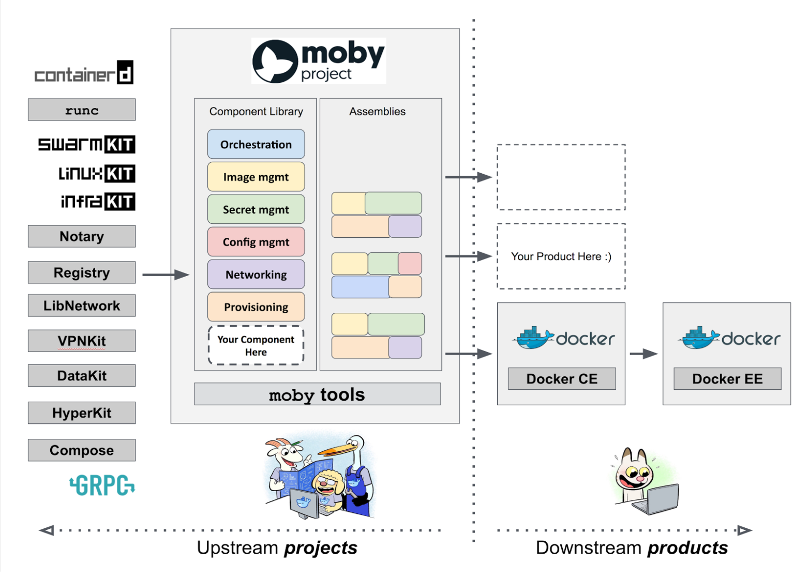
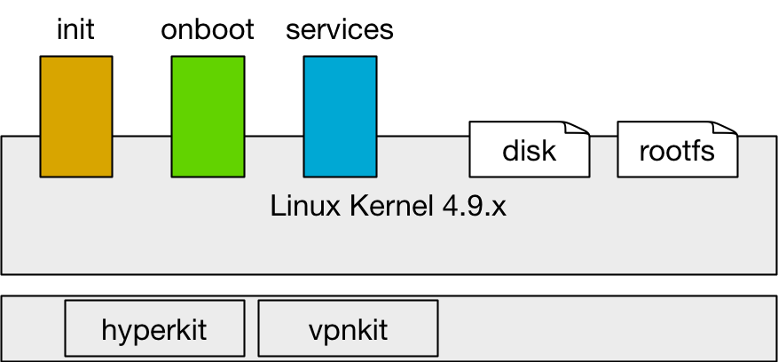
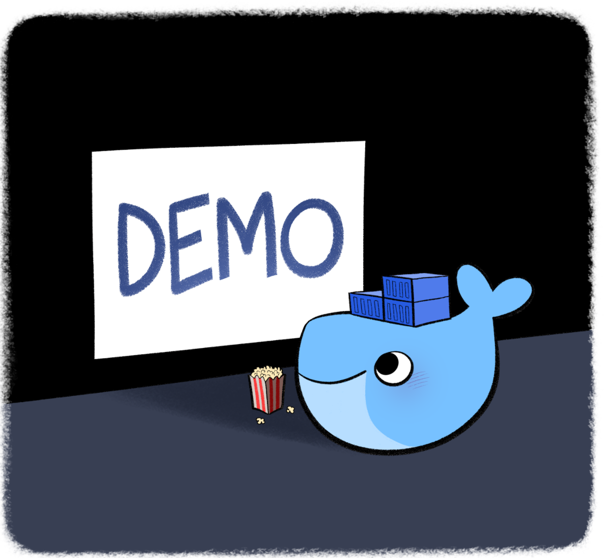
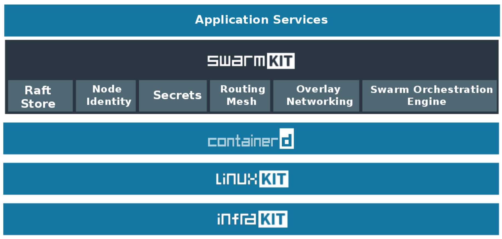
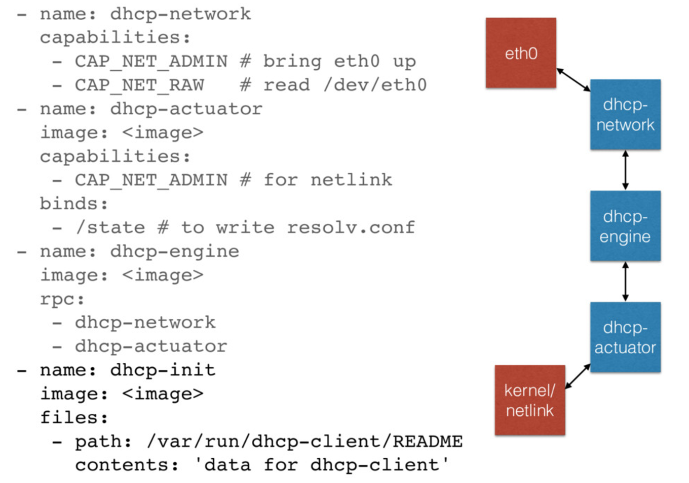
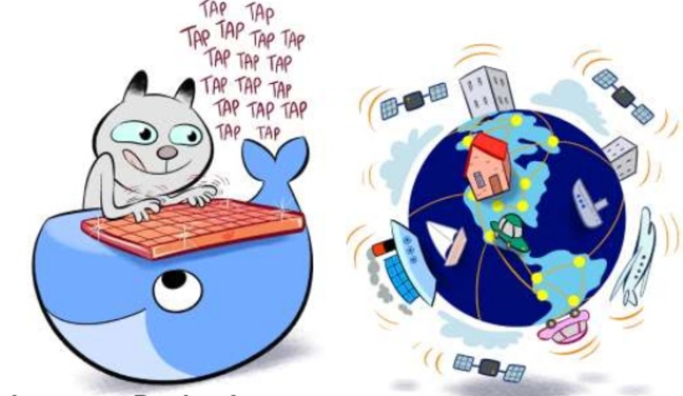
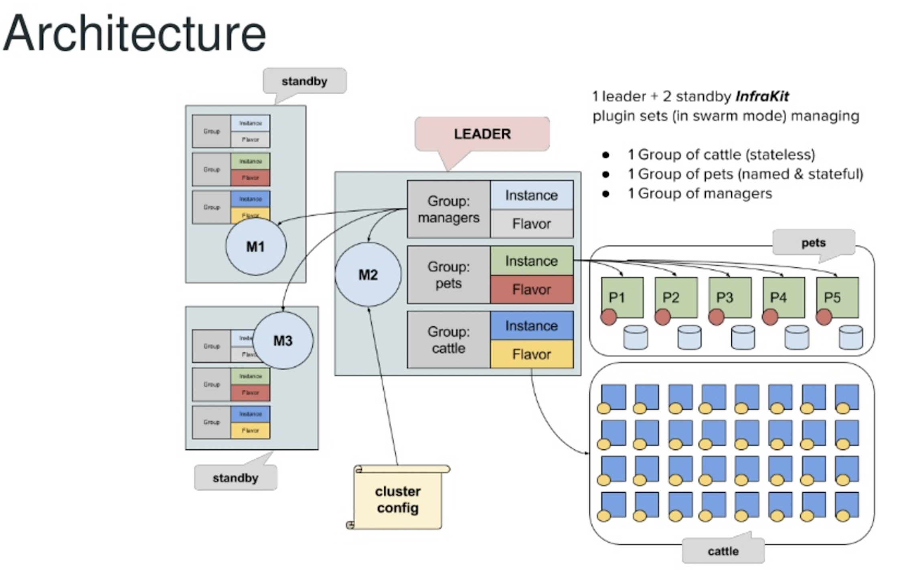
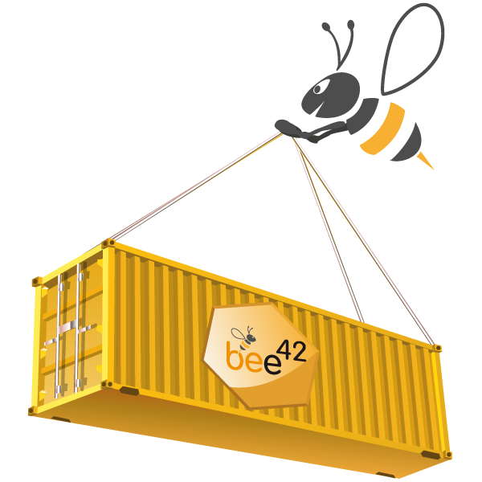

# Build your Immutable Infrastructure with the LinuxKit

* [ <peter.rossbach@bee42.com>](mailto:peter.rossbach@bee42.com)
* [@PRossbach](https://twitter.com/PRossbach)


---
## __A platform is only as secure__
## __as its weakest components__

***
* Snow Flakes- vs. Phoenix- Server

-

### Snowflakes Server

A Snow Flakes Server is a server that,

* properly patched to keep it up to date,
* configuration and software change over time,
* long running instance

-

### Phoenix Server

An Immutable Server is a server that

* once deployed,
* is never modified, 
* merely replaced with a new updated instance.

***
**Since phoenixes start everytime from scratch!**

-
### Why we want build those exotic animals? 

* Better DevProd Parity
* Better security: Lesser is More
* All is packaged inside the instance
* Reproduceablity of every component

---

## Moby Project



***
* Rebranding the Docker Open Source Project
* https://github.com/moby/moby

-
### Moby Project: Framework

* Library of 80+ components
* Package your own components as containers
* Reference assemblies deployed on millions of nodes
* Create your own assemblies or start from existing ones

---
## Linuxkit: Secure Mission

Only works with containers

* Smaller attack surface
* Immutable infrastructure
* Create Phoenix Server
* Sandboxed system

-

### Linuxkit: Incubator

Incubator for security innovations

* Wireguard, Landlock, KSPP
* MirageOS type safe system daemons
* okernel

***
Community-first security process

* Linux is too big for a single company to secure it
* Participate in existing Linux security efforts

---

## Linuxkit: Mission

* Secure defaults without compromising usability
* Everything is replaceable and customisable
* Immutable infrastructure applied to building Linux distributions
* Completely stateless, but persistent storage can be attached
* Easy tooling, with easy iteration
* Built with containers, for running containers

-
## Linuxkit: Mission

* Designed for building and running clustered applications,
  including but not limited to container orchestration 
  such as Docker or Kubernetes
* Designed from the experience of building Docker Editions, 
  but redesigned as a general-purpose toolkit
* Designed to be managed by external tooling, 
  such as Infrakit or similar tools
* Includes a set of longer-term collaborative projects 
  in various stages of development to innovate on kernel
  and userspace changes, particularly around security

***
* A toolkit for building custom minimal, immutable Linux distributions.

---
## Linuxkit: Build lean linux subsystems

* Minimal size, minimal boot time
* All system services are containers
* Everything can be removed or replaced
* Build for different plattforms

-
### Linuxkit: Install and test

```
$ brew tap linuxkit/linuxkit
$ brew install --HEAD moby
$ brew install --HEAD linuxkit
```

-
### Linuxkit: Overview Architecture



-
### Define Linuxkit OS-Image - kernel

```
kernel:
  image: "linuxkit/kernel:4.9.x"
  cmdline: "console=ttyS0 console=tty0 page_poison=1"
```

-
### Define Linuxkit OS-Image - init

```
init:
  - linuxkit/init:781cec2360313a6d4aca25f5e90623294f8432f7
  - linuxkit/runc:3a4e6cbf15470f62501b019b55e1caac5ee7689f
  - linuxkit/containerd:b50181bc6e0084e5fcd6b6ad3cf433c4f66cae5a
  - linuxkit/ca-certificates:75cf419fb58770884c3464eb687ec8dfc704169d
```

-
### Define Linuxkit OS-Image - onboot

```
onboot:
  - name: sysctl
    image: "linuxkit/sysctl:3aa6bc663c2849ef239be7d941d3eaf3e6fcc018"
  - name: sysfs
    image: linuxkit/sysfs:1244c5a86dfa2318c4e304af68d37e12367e1b7f
  - name: binfmt
    image: "linuxkit/binfmt:8ac5535f57f0c6f5fe88317b9d22a7677093c765"
  - name: format
    image: "linuxkit/format:180cb2dc1de5e60373385080f8148abf10a3afac"
  - name: mount
    image: "linuxkit/mount:ff5338822f20375b8913f5a80f9ed4f6ea9a592b"
    command: ["/mount.sh", "/var/lib/docker"]
```

-
### Define LinuxKit OS-Image - service

```
services:
  - name: getty
    image: "linuxkit/getty:886d35fe30c47750e8cfbf2f73016e9d2cc6361a"
    env:
     - INSECURE=true
  - name: rngd
    image: "linuxkit/rngd:1fa4de44c961bb5075647181891a3e7e7ba51c31"
  - name: dhcpcd
    image: "linuxkit/dhcpcd:7d2b8aaaf20c24ad7d11a5ea2ea5b4a80dc966f1"
  - name: ntpd
    image: "linuxkit/openntpd:45deeb05f736162d941c9bf494983f655ab80aa5"
  - name: docker
    image: "linuxkit/docker-ce:dda71ff9fe5ebbfa794b98c57c32df286b212848"
    capabilities:
     - all
    net: host
    mounts:
     - type: cgroup
       options: ["rw","nosuid","noexec","nodev","relatime"]
    binds:
     - /etc/docker/daemon.json:/etc/docker/daemon.json
     - /var/lib/docker:/var/lib/docker
     - /lib/modules:/lib/modules
files:
  - path: /etc/docker/daemon.json
    contents: '{"debug": true, "hosts": ["tcp://0.0.0.0:2375", "unix:///var/run/docker.sock"]}'
trust:
  org:
    - linuxkit
```

-
### Some Images use default config's...

```
...
"Labels": {
    "org.mobyproject.config": "{\"pid\": \"host\", \"readonly\": true,
     \"capabilities\": [\"CAP_SYS_ADMIN\"]}"
}
...
```
-
### Build and Run a linuxkit host

```
$ moby build --output kernel+initrd docker.yml
$ linuxkit run hyperkit \
  -ip 192.168.65.101 \
  -disk $PWD/disk-101,size=4G \
  -state $PWD/docker-state-101 \
  docker
$ runc exec -t docker /bin/sh
$ docker ps
$ curl http://127.0.0.1:2375/v1.28/info
```

-
### Access linuxkit host at your mac

```
$ docker run --rm -i docker
> export DOCKER_HOST=tcp://192.168.65.101:2375
> docker info
> docker run
```

or

```
$ cat >Dockerfile <<EOF
FROM alpine:edge
RUN apk add --no-cache socat
ENTRYPOINT [ "/usr/bin/socat" ]
EOF
$ docker build -t socat .
# Set PORT and MACHINE_IP
$ PORT=2375
$ MACHINE_IP=192.168.65.101
$ docker run --rm -t -d -p $PORT:$PORT socat tcp-listen:$PORT,reuseaddr,fork tcp:${MACHINE_IP}:$PORT
$ docker -H 127.0.0.1:2375 info
```

-
### Linuxkit: Demo



-
### Linuxkit: Environment



-
### Linuxkit  Providers

* hyperkit
* qemu
* hyper-v
* vmware
* AWS
* GCE
* Azure
* packet.net

-
### Linuxkit Portable Plans

* Desktop, Server, IoT, Mainframe
* Intel & ARM
* Bare Metal & Virtualized
* On prem & in the Cloud

-
### Linuxkit Kernel support

* 4.4.x
* 4.9.x
* 4.11.x

-
### LinuxKit Sigs


***
https://speakerdeck.com/avsm/a-modern-services-sdk-for-linuxkit

---

## Infrakit



-

### Infrakit Architecture



---
## Build your own Phoenix Servers with Linuxkit

* Build your own linux distriubution
* Package all parts inside containers
* Build with secure in mind
* Speed up your boottime


---
## bee42: Trainings and Consulting

* Container DevOps Camp
  * https://bee42.com/trainings/docker-devops-camp/
* Kubernetes DevOps Lab
  * https://bee42.com/trainings/kubernetes-devops-lab/
* Container for Java Lab
  * https://bee42.com/trainings/docker-for-java-lab/
* Container GitLab/CI Lab
  * https://bee42.com/trainings/docker-gitlab-ci-lab/

***
* ContainerDays 2017 Rabattt 20%  __CDS17-20__

---
## Open the doors for Q&A...



-
### Send me a message
### <peter.rossbach@bee42.com> @PRossbach


-
### The DevOps-Community needs you !

* Peter Rossbach
  * DevOps and Container-enthusiast
  * Infra-coder with passion
  * System architect
  * Java Developer
  * Apache Tomcat Committer
  * Member of the Apache Software Foundation
  * Founder of the bee42 solutions gmbh
  * CTO of the Setlog Gmbh

---
## Links

* https://github.com/linuxkit/linuxkit
* https://bee42.com/blog/linuxkit-with-initial-aws-support/
* https://blog.docker.com/2017/06/introduction-to-linuxkit/
* https://de.slideshare.net/Docker/introducing-linuxkit
* https://speakerdeck.com/avsm/a-modern-services-sdk-for-linuxkit
* https://blog.docker.com/2017/04/introducing-linuxkit-container-os-toolkit/
* http://training.play-with-docker.com/LinuxKit/